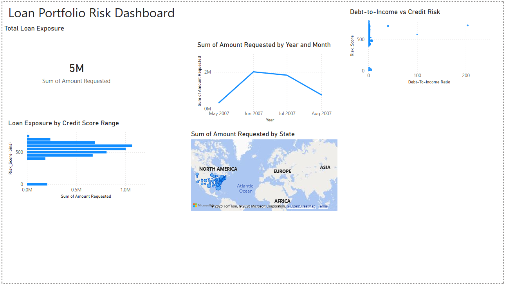

## Loan Portfolio Risk Dashboard

This project analyzes loan portfolio data to identify borrower risk patterns, loan exposure trends, and credit risk indicators.

## Dashboard Preview

## Tools Used

- SQL
- Python (Pandas, Scikit-learn)
- Power BI

## Key Analysis

- Loan exposure analysis
- Credit score segmentation
- Debt-to-income risk analysis
- Geographic loan exposure
- Loan demand trends over time

## Insights

- Borrowers with higher debt-to-income ratios show greater risk concentration.
- Loan exposure is heavily distributed in mid-range credit scores.
- Certain states have significantly higher lending activity.

## Project Structure

credit-risk-portfolio
│
├── README.md
├── dashboard.png
│
└── loan-portfolio-risk-analysis
    ├── dataset
    ├── sql_analysis.sql
    └── credit_risk_analysis.py
